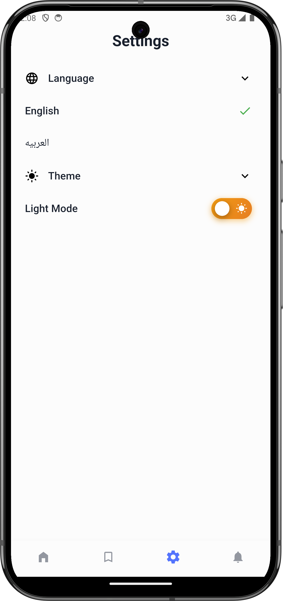
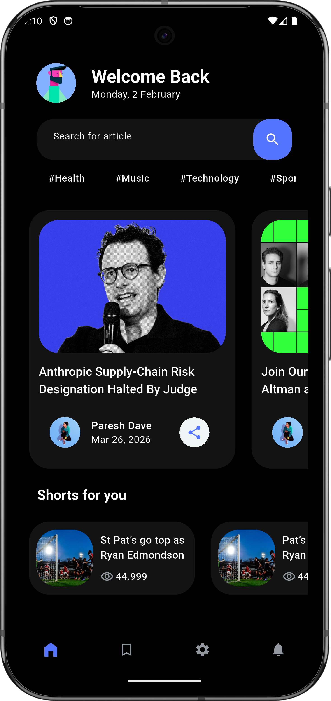
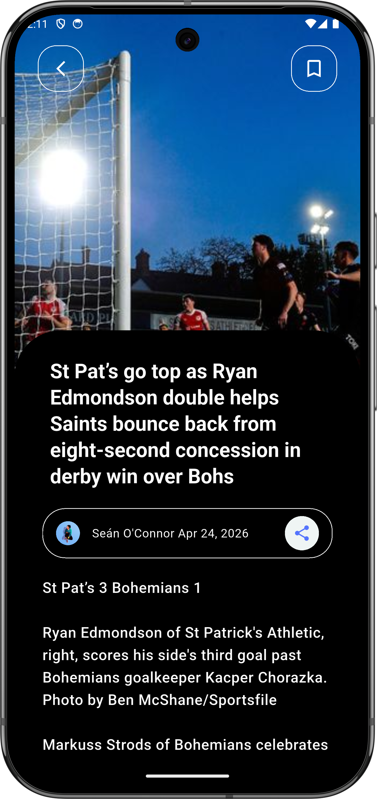
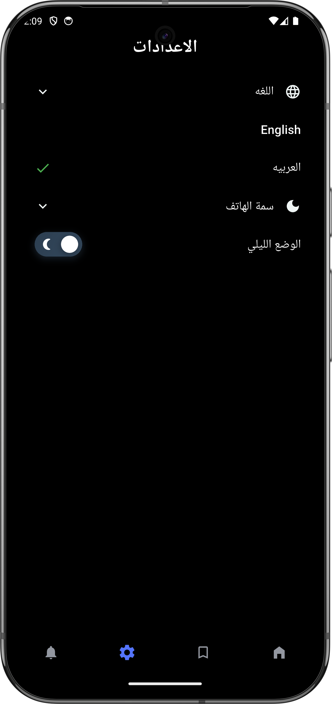

# 📰 News App

A modern Flutter news application that fetches the latest news from online APIs and displays them in a clean and user-friendly interface.

---

## 🚀 Features

- 🔍 Search for news articles
- 📰 Browse latest headlines
- 🌐 API integration for real-time data
- 📡 Internet connectivity handling
- ⚠️ Error handling (No Internet / Server issues)
- 🌙 Light & Dark mode support
- 📱 Responsive design for different screen sizes

---

## 🛠️ Tech Stack

- Flutter
- Dart
- REST APIs
- Dio
- State Management (Cubit / Bloc)

---

## 📦 Packages Used

- connectivity_plus → Check network connection
- dio → API requests
- flutter_bloc → State management
- device_preview → Test responsive UI

---

## 📸 Screenshots

### Light Mode

| Home Screen                            | Save Screen                          | Details Screen                             |
|----------------------------------------|--------------------------------------|--------------------------------------------|
|  |  |  |

| Settings Screen                              | Tags Screen                          |
|----------------------------------------------|--------------------------------------|
|  |  |

### Dark Mode

| Home Screen                            | Details Screen                               | Settings Screen                                |
|----------------------------------------|----------------------------------------------|------------------------------------------------|
|  |  |  |

### Arabic Language

| Home Screen                            | Details Screen                               |
|----------------------------------------|----------------------------------------------|
|  |  |


---

## ⚙️ Installation

1. Clone the repo:
```bash
git clone https://github.com/your-username/news-app.git
```

2. Navigate to the project:
```bash
cd news-app
```

3. Install dependencies:
```bash
flutter pub get
```

4. Run the app:
```bash
flutter run
```

---

## 🔌 API

The app uses a news API to fetch data such as:
- Top headlines
- Search results

---

## ❗ Error Handling

- Shows message when there is no internet connection
- Handles API errors gracefully
- Prevents app crashes on network failure

---

## 📌 Future Improvements

- ❤️ Save favorite articles
- 🔔 Push notifications
- 📂 Categories (Sports, Tech, Business...)
- 🌍 Multi-language support

---

## 👩‍💻 Author

**Habiba Tamer**  
Computer Science Graduate | Flutter Developer

---

## ⭐ Support

If you like this project, give it a ⭐ on GitHub!